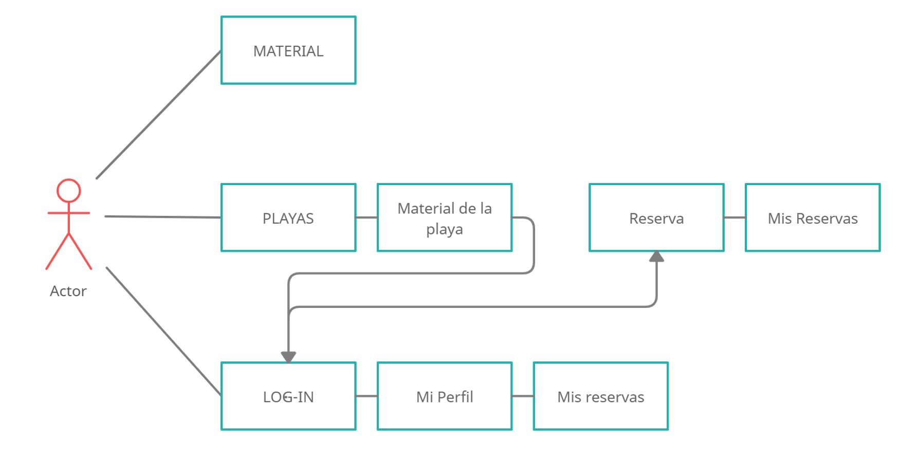
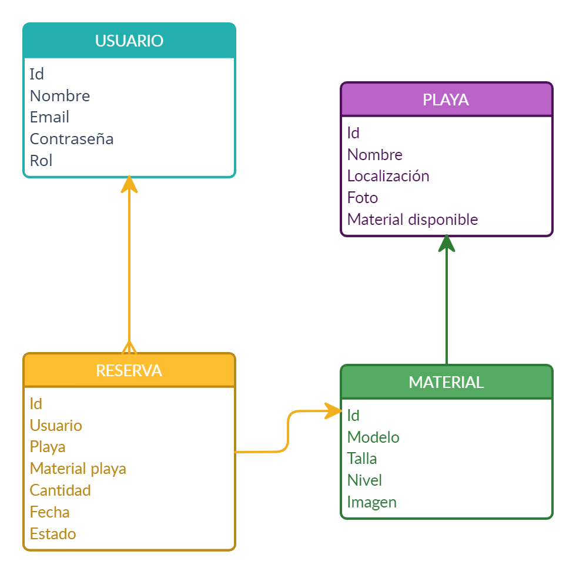

# W2 Surf Rental

https://w2-surf-rental.herokuapp.com/

## 1. Descripción 

W² Surf Rental es una página web de alquiler de material deportivo. Está pensado específicamente para una empresa con presencia en diferentes playas en las que tendrá disponible material para deportes acuáticos. 

El usuario podrá seleccionar una de las playas en las que haya material a alquilar y dentro de esa playa podrá escoger el equipo deportivo que necesite para un día concreto y su cantidad (siempre y cuando ese equipo está disponible). 

Tras la reserva, ese material quedará adjudicado al usuario para el día seleccionado y se le enviará un identificador único para poder presentarlo en la empresa de alquiler y recoger el material. En una primera versión, el pago no estaría disponible en la web.

## 2. Descripción funcional

Los usuarios podrán interactuar de las siguientes maneras en esta página web:

- Ver todas las playas en donde están disponibles los alquileres y seleccionar una para ver el material.
- Seleccionar el material en la playa escogida, la fecha del alquiler y la cantidad. Si el material está agotado en la fecha seleccionada, aparecerá un aviso y no se podrá escoger.
- Ir a Mis Reservas para comprobar las reservas realizadas
- Ir a Mi Perfil para ver los datos personales y el acceso a Mis Reservas

La barra de navegación web cuenta con 5 links sobre los que navegar para usuarios y 6 para administradores:

- HOME
- PLAYAS
- MATERIAL
- LOG-IN
- MI PERFIL
- ADMIN (solo en el caso de estar autorizado)

HOME:

Carrousel de imágenes con texto solo con fin visual y estético.

PLAYAS:

En un primer lugar se muestra un mapa personalizado con la localización de los puntos de alquiler.
Después aparece la lista de todas las playa con su foto para acceder a la que se quiera seleccionar y ver el material disponible (no tienen el mismo material ni cantidades).
Dentro de la playa accedemos al material concreto de esa playa. Lo primero será seleccionar la fecha en la que se quiere alquilar y después revisar la lista de material disponible. Cada material tiene su fotografía y sus características. 
Para poder reservar es necesario estar logueado, si no el botón que aparecerá en cada material será el de login en vez del de “reservar”.
A la derecha del botón de “reservar” está la opción de marcar la cantidad. Si no se añade ninguna cantidad, en la siguiente pantalla que será la “RESERVA” se tendrá que poner. A su vez, si se quiere añadir o restar material, en esta pantalla se podrá hacer. 

- RESERVA:

Esta opción solo aparece después de acceder por los puntos anteriores (PLAYAS/MATERIAL). Se verá la reserva que se quiere hacer del material seleccionado, su foto, características, cantidad y fecha. Al aceptar la reserva, nos llevará a “MIS RESERVAS”.

MATERIAL: 

Listado de todo el material de la empresa sin estar asociado a ninguna playa.

lOG-IN:

Acceso para loguearse. Si no se dispone de cuenta, está la opción de registrarse primero.

MI PERFIL:

Datos del usuario registrado y logueado. Está la opción de Log-Out y de ir a “MIS RESERVAS”.

ADMIN:

Para acceder como administrador, la cuenta tiene que estar validada como tal. En estos momentos, siendo administrador se puede crear un nuevo material.

## Casos de uso:

Cualquier persona podrá ver el material general, las playas y la disponibilidad del material específico de cada playa pero para generar una reserva es necesario registrarse y estar logueado.

En el caso de ser administrador, es necesario estar logueado con la cuenta que contenga ese rol para poder ver las opciones específicas.

## 3. Descripción técnica Back-End:

A continuación se muestra un esquema de los modelos que serán la base de toda la información mostrada en la web, asi como las rutas para crear y acceder a los datos:

-USUARIO

1. POST: /signup. Ruta publica para registro de nuevo usuario.

2. POST: /signup/newAdmin. Ruta para registro de administrador.

3. POST: /login. Ruta publica para login de usuario ya registrado.

4. GET: /login/oneUser. Ruta privada para ver un usuario registrado.

5. PUT: /changePassword. Ruta privada para realizar el cambio de contraseña.

6. PUT: /forgot-Password. Ruta privada para enviar un email para reestablecer contraseña.

-RESERVA:

1. POST: /newRental/:beachId. Ruta privada para crear la reserva

2. GET: /myRental. Ruta privada para ver todas las reservas de un usuario.

3. GET: /allRental/listOfRental. Ruta privada de admin para ver todas las reservas de los usuarios

4. GET: /myRental/:nuevaReservaId. Ruta privada para ver una reserva del usuario.

5. DELETE: /deleteMyRental/:id. Ruta privada para eliminar una reserva.

6. PUT: /allRental. Comparar las reservas por días para devolver el stock cuando pase la fecha de la reserva1. 

-PLAYA:

1. POST: /nerBeach. Ruta privada de admin para la creación de nuevas playas.

2. GET: /. Ruta pública para ver todas las playas.

3. GET: /find/:id. Ruta pública para ver solo una playa.

4. PUT:/addEquipment. Ruta privada de admin para añadir material a una playa 

5. PUT:/removeEquipment/:id. Ruta privada de admin para eliminar material a una playa 

6. PUT:/addEquipment/stock. Ruta privada de admin para añadir stock de un material a una playa 

7. PUT:/removeEquipment/stock. Ruta privada de admin para eliminar stock de un material a una playa 

8. DELETE: /deleteBeach/:id. Ruta privada de admin para eliminar una playa.

-MATERIAL:

1. POST: /createEquipment. Ruta privada de admin para crear un nuevo material

2. GET: /allEquipment. Ruta pública para ver todo el material sin estar asociado a una playa.

3. GET: /oneEquipment/:id. Ruta pública para ver un material en concreto sin estar asociado a una playa.

4. DELETE: /deleteEquipment/:id. Ruta privada de admin para eliminar un material.

Para comprobar la autentificación del usuario contamos con un middleware que se encarga de revisar el token del mismo, dandole asi, acceso a las rutas privadas.

Por otro lado, usamos Cloudinary para añadir las fotografías tanto de las playas como del material a la base de datos y mostrarlas posteriormente a los usuarios.

## 5. Tecnologías:

Para este proyecto MERN, se han utilizado las siguientes tecnologías de desarrollo web:

- HTML.
- CSS.
- Boostrap.
- Vanilla JS.
- GitHub.
- API y Json.
- Postman.
- NodeJS: npm, express, nodemon, dotenv, validator, mongoose, multer, bycript, jwt, axios, cors, concurrently.
- MongoDB.
- React.

## 6. Versiones:

v.1.0 Primera Version (12/07/21)

## TO DO:

- Incluir todas las funciones del administrador.
- Mejorar el diseño de la versión web.
- Envío de email para reestablecer contraseña.
- Añadir un apartado de “Actividades”.

